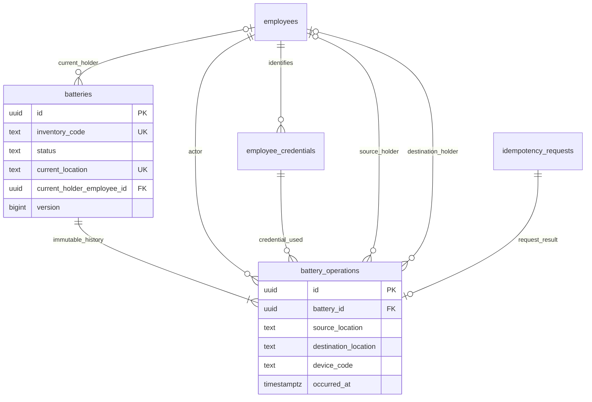

# ER-модель v2: адреса текстом

> Статус реализации 30.09.2026: проверенный локальный MVP создан на ветке feature/text-location-mvp. Подтверждённый пользователем формат адреса — три положительных числа шкаф.полка.ячейка без ведущих нулей (Q30 закрыт). Сотрудники и карты могут быть тестовыми локальными данными. Корпоративный источник и authentication/authorization ещё не согласованы. Текущий запуск и результаты проверок: README.md в корне и verification.md. Ниже сохранено проектное обоснование; прежние пометки «backend ещё не реализован» относятся к состоянию до этого этапа.

Обновлено 30.09.2026 по сообщению пользователя о решении руководителя: шкафы, полки и ячейки не выделять в таблицы; место хранить текстом в battery_operations. Приложенная картинка — прежние семь таблиц, а не новая модель. Теперь четыре предметные таблицы: employees, employee_credentials, batteries, battery_operations. Дополнительно одна техническая idempotency_requests для безопасных повторов API. Devices не включена; device_code — nullable text операции.

Полный DDL и именованные ограничения — [schema.sql](schema.sql). Изменения не применяются к working migrations. Старая демонстрация продолжает использовать свою модель.

## Текстовое место и текущая проекция

`1.1.1` — иллюстративный адрес: шкаф 1 / полка 1 / ячейка 1. Формат и канонизацию требуется подтвердить, а не выдумать regex. Хранится TEXT COLLATE C, непустой, без крайних обычных пробелов. Сравнение точное: `1.1.1` и `01.1.1` пока разные строки. Требуется единое написание одного физического места (Q30).

source_location/destination_location — исторические снимки адресов. current_location в batteries — быстрое текущее состояние и ключ проверки занятости, обновляется атомарно с журналом. Это не справочник мест. FK на адрес отсутствует; физическое существование и отключение места не проверяются. История сохраняет прежний текст при дальнейших перемещениях; без ID места нельзя автоматически определить, означают ли старое и новое названия одну ячейку.

## Общие соглашения

UUID PK создаёт Go. Master-таблицы: created_at/updated_at NOT NULL TIMESTAMPTZ с server default, disabled_at nullable TIMESTAMPTZ с CHECK NULL либо >=created_at. is_active в API — disabled_at IS NULL, не вторая колонка. Все исторические FK ON DELETE RESTRICT. Credential и inventory_code — точные строки, ведущие нули сохранены, формат физической маркировки не утверждён. ID/credential identity/inventory_code неизменяемы trigger. Ordinary DELETE нет в API и runtime grants.

## employees — сотрудник независимо от карты

Поля: id UUID PK; display_name TEXT NOT NULL CHECK непустого имени; personnel_number TEXT NULL UNIQUE CHECK непустого при наличии; общие времена. Имя не уникально. Индексы PK/personnel_number UNIQUE. Источник и область уникальности табельного номера — Q05. Смена карты не создаёт человека заново. Предлагается запрет деактивации сотрудника с custody до сверки.

## employee_credentials — предъявляемые идентификаторы

Поля: id UUID PK; employee_id UUID NOT NULL FK employees; value TEXT COLLATE C NOT NULL CHECK непустого; общие времена. UNIQUE(id,employee_id) позволяет журналу проверить принадлежность карты actor. Partial UNIQUE value WHERE disabled_at IS NULL защищает активное сопоставление. Индекс(employee_id,created_at,id) — список карт.

Нет UNIQUE(employee_id): несколько активных карт допустимы. Value/employee_id неизменяемы. Замена одной транзакцией отключает только указанную старую и создаёт новую. Старые события ссылаются на прежний credential ID/value. Повторное назначение исторического значения другому человеку — Q26, до решения запрещено сервисом. Credential определяет actor, но не заменяет authentication API.

## batteries — реестр и текущее состояние

| Поле | PostgreSQL / ограничения | Назначение |
|---|---|---|
| id | UUID PK | Внутренняя идентичность |
| inventory_code | TEXT COLLATE C NOT NULL UNIQUE, непустой | Учётный код без предположения о barcode/QR |
| serial_number | TEXT NULL, непустой при наличии | Необязательный; UNIQUE не утверждён |
| status | TEXT NOT NULL CHECK STORED/ISSUED | Минимальные состояния MVP |
| current_location | TEXT COLLATE C NULL, непустой без крайних пробелов | Текущий адрес целиком |
| current_holder_employee_id | UUID NULL FK employees | Учётный держатель |
| version | BIGINT NOT NULL CHECK >0 | Порядок переходов |
| created_at / updated_at | TIMESTAMPTZ NOT NULL | updated_at равно occurred_at последней операции |

CHECK: STORED требует location и NULL holder; ISSUED требует holder и NULL location. Первое создание атомарно выполняет STORE/v1; отдельный unplaced lifecycle — только после Q29. Type/model не добавлены автоматически.

Индексы: PK, inventory_code UNIQUE; partial UNIQUE current_location WHERE current_location IS NOT NULL; partial(holder,id); (status,id). Одна АКБ на место подтверждена пользователем. UNIQUE защищает один точный канонический адрес, но не физическую эквивалентность двух разных написаний. Deferred guard сверяет current с последней операцией.

## battery_operations — история переходов

| Поле | PostgreSQL / ограничения | Назначение |
|---|---|---|
| id | UUID PK | Операция |
| battery_id | UUID NOT NULL FK batteries | АКБ |
| battery_version | BIGINT NOT NULL >0 | Порядок перехода |
| type | TEXT NOT NULL CHECK STORE/TAKE/RETURN/MOVE | Поддерживаемое действие |
| actor_employee_id | UUID NOT NULL FK employees | Кто выполнил |
| credential_id | UUID NOT NULL composite FK с actor | Предъявленный исторический credential |
| source_status / destination_status | TEXT NULL / TEXT NOT NULL, CHECK STORED/ISSUED | NULL source только первого STORE |
| source_location / destination_location | TEXT COLLATE C NULL, непустой без крайних пробелов | Старый и новый адрес снимком |
| source_holder_employee_id / destination_holder_employee_id | UUID NULL FK employees | Прежний и новый держатель |
| device_code | TEXT COLLATE C NULL, непустой при наличии | Метка известного устройства, не UUID/FK |
| request_scope / request_key | TEXT/UUID NOT NULL composite FK requests | Идемпотентная команда |
| occurred_at | TIMESTAMPTZ NOT NULL | Server timestamp оформления |

UNIQUE(battery_id,battery_version) и UNIQUE(request_scope,request_key): одна версия и одна операция АКБ на команду. Для future batch вторую уникальность пересмотреть. Updated_at нет, запись не редактируется.

| Тип | Source location | Destination location | Source holder | Destination holder | Переход |
|---|---|---|---|---|---|
| STORE v1 | NULL | required | NULL | NULL | NULL→STORED |
| TAKE v>1 | required | NULL | NULL | actor | STORED→ISSUED |
| RETURN v>1 | NULL | required | required, =actor | NULL | ISSUED→STORED |
| MOVE v>1 | required | required, ≠source | NULL | NULL | STORED→STORED |

Shape CHECK включает явные IS NOT NULL, чтобы UNKNOWN не пропускал неверную форму. Deferred triggers сверяют source с предыдущей версией и current с последней; не допускают разрывов версии. UPDATE/DELETE/TRUNCATE истории запрещены trigger. Owner/superuser остаётся границей доверия; это не tamper-proof система.

Индексы: UNIQUE(battery_id,battery_version) покрывает обратное чтение истории; (occurred_at DESC,id DESC); (actor_employee_id,occurred_at DESC,id DESC); partial по source/destination holder, source/destination location и device_code с сортировкой времени; credential_id. Отдельный type index без данных о селективности не нужен. Исторические адреса не требуют JOIN мест; имя сотрудника читается как текущая подпись по устойчивому ID.

## idempotency_requests — техническая таблица, не предметная сущность

Поля: scope TEXT COLLATE C NOT NULL непустой; key UUID NOT NULL; PK(scope,key); request_hash CHAR(64) NOT NULL CHECK lower hex; http_status SMALLINT NULL CHECK 2xx/404/409/422; response_body JSONB NULL; created_at TIMESTAMPTZ NOT NULL. Scope — доверенный stable API principal, не карта и не произвольный device_code.

Status/body оба NULL только внутри reservation либо оба заполнены. Deferred guard запрещает incomplete COMMIT. Completed result/identity неизменяемы; DELETE/TRUNCATE запрещены до согласования retention. Таблица сохраняет первоначальный ответ после timeout, включая сотрудника/credential, где события АКБ нет. Один ключ в журнале не заменяет result cache. Дополнительные индексы без retention job не нужны.

## Связи текстом

- employees 1:N employee_credentials — карты меняются, человек остаётся.
- employees 1:N batteries по current holder — один держатель у АКБ, несколько АКБ у сотрудника до подтверждения лимита.
- batteries 1:N battery_operations — последовательность STORE и последующих переходов.
- employees 1:N operations по actor и отдельно по source/destination holder — разные роли; для RETURN actor=source holder.
- credentials 1:N operations — прежняя карта сохраняется в истории.
- requests 1:0..1 operations — успешное движение создаёт одно; справочники/ошибки не создают движения.
- Location/device_code — текстовые атрибуты без связанных таблиц и FK.

## Границы выбранного упрощения

Нет FK существующего места, конфигурации числа полок/ячеек, списка всех пустых мест или выключения места. Пустой GET по адресу означает отсутствие АКБ в учёте, не существование пустой ячейки. При смене правила на несколько АКБ можно убрать UNIQUE current_location согласованной миграцией, но без справочника/capacity ограничить N нельзя. Это альтернативное объяснение, не MVP. Старая картинка с семью таблицами описывает заменённый вариант.
