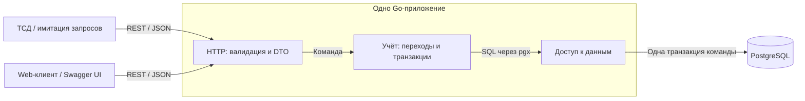

# Архитектура и контракт макета

Проектный вариант, 29.09.2026. [Требования](spec.md), [сценарии](research.md), [модель](er-model.md), [OpenAPI](openapi.yaml).

## Компоненты

Справочники владеют сотрудниками, credential и местами. Учёт владеет batteries, battery_operations и правилами переходов. Механизм идемпотентности оборачивает изменяющие команды, используя ту же транзакцию. Чтения выбирают состояние и историю; не изменяют их и не публикуют события.

Предлагаемая структура будущего Go: cmd/ — запуск; internal/domain/ — состояния/ошибки; internal/service/ — команды и границы транзакций; internal/repository/ — SQL через переданную транзакцию; internal/transport/http/ — HTTP/DTO; migrations/ — версии SQL; docs/ — контракт. Интерфейсы нужны на фактических границах тестирования/замены, а не для каждого файла. Существующий более компактный internal/api допустим для прототипа; реорганизация папок не самоцель.

## Переходы

| Команда | До | После | Участник |
|---|---|---|---|
| STORE | Экземпляр ещё не зарегистрирован | STORED, целевая ячейка, version=1 | Любой активный сотрудник макета |
| TAKE | STORED | ISSUED, holder=actor, cell=NULL | Получает для себя |
| RETURN | ISSUED | STORED, holder=NULL, целевая ячейка | Только прежний holder |
| MOVE | STORED, источник совпадает с ожидаемым | STORED, другая ячейка | Любой активный сотрудник макета |

current state и immutable history — две модели хранения в общей БД, не отдельные сервисы. При успешной команде version увеличивается на 1 и ровно такое значение пишется в событие. updated_at берётся из recorded_at этого события. Журнал содержит ID credential, автора и прежнего/нового держателя, а не только текст имени.

## Транзакция и блокировки

Уровень READ COMMITTED. Последовательность новой учётной команды:

1. Проверить размер/JSON/формат входа; начать транзакцию, установить предельное ожидание.
2. INSERT idempotency_records ... ON CONFLICT DO NOTHING. При существующем ключе проверить хэш и вернуть сохранённый ответ либо 409; к бизнес-проверкам повтор не идёт.
3. Разрешить credential до employee_id, заблокировать employee FOR SHARE, затем credential FOR SHARE и заново проверить принадлежность/активность обоих. Отзыв/замена используют тот же порядок employee → credential, с конфликтующими блокировками.
4. Для существующей АКБ SELECT её строки FOR UPDATE; после ожидания проверить состояние, holder и expected_source_cell_id. STORE полагается на уникальность нового inventory_code.
5. Для назначения: заблокировать целевые cabinet → shelf → cell FOR SHARE; проверить disabled_at у всех. Родители/номера не редактируются через API. UNIQUE current_cell_id арбитрирует конкуренцию за место.
6. Обновить/создать АКБ, INSERT событие, присвоить updated_at из recorded_at, сохранить HTTP-статус и response_body ключа.
7. COMMIT, только затем отправить успех. Любая ошибка до фиксации — ROLLBACK.

Отключение ячейки: зарезервировать ключ → FOR UPDATE ячейки → проверить отсутствие batteries.current_cell_id → установить disabled_at → сохранить ответ → COMMIT. Оно не блокирует батареи после ячейки. Если размещение успело первым, отключение увидит занятость; если отключение первым — размещение увидит disabled_at. Повтор отключения уже пустой отключённой ячейки с новым ключом возвращает 200 без нового времени отключения.

Замена credential: ключ → employee FOR UPDATE → заменяемый credential FOR UPDATE → проверить принадлежность и отсутствие отзыва → отозвать старый и вставить новый → сохранить ответ → COMMIT. Права на UPDATE value/employee_id у API отсутствуют как маршруты; старый credential никогда не перепривязывается. При добавлении без замены сохраняются прочие активные карточки. Отзыв уже отозванного credential возвращает 200 без изменения времени.

Для двух TAKE одной АКБ второй запрос ждёт FOR UPDATE, затем видит ISSUED и получает 409. Для двух АКБ в одну ячейку один INSERT/UPDATE проигрывает UNIQUE; ошибка конкретного индекса становится CELL_OCCUPIED после отката. Ошибки уникальности кода и номера имеют другие коды.

Deadlock/lock timeout/недоступность БД → 503 TEMPORARILY_UNAVAILABLE. При неизвестном исходе COMMIT клиент повторяет прежний ключ; не предполагает ни успех, ни откат. Отдельных внешних побочных эффектов в этой транзакции нет. Семантика блокировок: [PostgreSQL 17 — Explicit Locking](https://www.postgresql.org/docs/17/explicit-locking.html).

## Идемпотентность

Ключ — строка 1–128 ASCII-символов `[A-Za-z0-9._:-]`; рекомендуется UUID. Пространство глобально для локальной БД макета. Все изменяющие POST требуют ключ, POST /credentials/resolve — чтение и ключа не требует.

request_hash = SHA-256 от METHOD + перевод строки + канонический путь + перевод строки + канонический JSON валидированного тела. UUID приводятся к нижнему регистру, name обрезается по краям, коды не меняются; поля JSON сортируются. Query для изменяющих команд запрещён. Неизвестные/повторяющиеся поля и null отвергаются до резервирования.

Конкурентный одинаковый ключ ждёт исхода первого INSERT. Если первая команда зафиксировалась, следующий SELECT читает завершённый ответ; если откатилась, повтор резервирует ключ и исполняет команду. Не коммитить запись с пустым ответом. Сохраняются только успешные ответы; ошибку можно исправить и повторить с тем же незафиксированным ключом.

Повтор возвращает исходный статус и JSON-значения, а не новое текущее состояние. Даже после RETURN или отзыва старой карты повтор прежнего TAKE не выполняет выдачу заново. Для нового положения нужен GET. Ключи не очищаются автоматически в макете. Это не обещание offline-работы или контроля физических выдач.

## REST API v1

Короткие схемы ниже полностью определены в openapi.yaml. Общий ответ команды АКБ — CommandResult {operation,battery}. Все изменяющие команды имеют идемпотентный повтор; чтения безопасно повторять. Авторизации в макете нет. Условные коды в теле — идентификация участника.

| Метод | Путь после /api | Назначение и request | Response | Предметные ошибки |
|---|---|---|---|---|
| POST | /employees | CreateEmployee: name, credential_value | 201 Employee | 409 CREDENTIAL_EXISTS |
| GET | /employees | limit, offset | 200 EmployeePage | 400 |
| GET | /employees/{employee_id} | UUID | 200 Employee | 404 |
| POST | /credentials/resolve | ResolveCredential: value | 200 CredentialResolution | 404 CREDENTIAL_NOT_FOUND |
| GET | /employees/{employee_id}/credentials | UUID, limit, offset | 200 CredentialPage, включая отозванные | 404 |
| POST | /employees/{employee_id}/credentials | AddCredential: value; optional replaces_credential_id | 201 Credential | 404; 409 CREDENTIAL_EXISTS/CREDENTIAL_REVOKED/EMPLOYEE_DISABLED |
| POST | /credentials/{credential_id}/revoke | Пустое тело не требуется | 200 Credential | 404 |
| GET/POST | /cabinets | Список / CreateNumber: number | 200 CabinetPage / 201 Cabinet | 409 NUMBER_EXISTS |
| GET/POST | /cabinets/{cabinet_id}/shelves | Список / CreateNumber | 200 ShelfPage / 201 Shelf | 404; 409 NUMBER_EXISTS/LOCATION_DISABLED |
| GET/POST | /shelves/{shelf_id}/cells | Список / CreateNumber | 200 CellPage / 201 Cell | 404; 409 NUMBER_EXISTS/LOCATION_DISABLED |
| POST | /cells/{cell_id}/disable | Без тела | 200 Cell | 404; 409 CELL_OCCUPIED |
| GET | /cells/{cell_id}/batteries | UUID, limit, offset | 200 BatteryPage с 0..1 элементом | 404 |
| POST | /batteries | STORE: inventory_code, employee_credential, destination_cell_id; optional device_code | 201 CommandResult | 404; 409 INVENTORY_CODE_EXISTS/CELL_OCCUPIED/LOCATION_DISABLED |
| GET | /batteries | limit, offset, inventory_code/status/cell_id/holder_employee_id | 200 BatteryPage | 400 |
| GET | /batteries/{battery_id} | UUID | 200 Battery | 404 |
| POST | /batteries/{battery_id}/take | ActorCommand: employee_credential; optional device_code | 201 CommandResult | 404; 409 BATTERY_ALREADY_ISSUED |
| POST | /batteries/{battery_id}/return | ReturnCommand: actor + destination_cell_id | 201 CommandResult | 404; 409 NOT_CURRENT_HOLDER/INVALID_BATTERY_STATE/CELL_OCCUPIED/LOCATION_DISABLED |
| POST | /batteries/{battery_id}/move | MoveCommand: actor + destination_cell_id + expected_source_cell_id | 201 CommandResult | 404; 409 SOURCE_MISMATCH/SAME_CELL/INVALID_BATTERY_STATE/CELL_OCCUPIED/LOCATION_DISABLED |
| GET | /batteries/{battery_id}/history | limit, offset | 200 OperationPage | 404 |
| GET | /employees/{employee_id}/batteries | limit, offset | 200 BatteryPage | 404 |
| GET | /operations | limit, offset, battery_id, actor_employee_id, cell_id, from, to | 200 OperationPage | 400 |
| GET | /operations/{operation_id} | UUID | 200 Operation | 404 |

Явные команды удобнее Swagger и простым ТСД: небольшое тело каждого действия. Альтернатива POST /operations с discriminator/type объединяет команды, но усложняет DTO и сообщения валидации. Общий ресурс /operations здесь только для чтения. STORE совмещён с созданием /batteries; это не разрешает CRUD статуса.

Источник TAKE берётся только из БД. Для MOVE expected_source_cell_id — условие выполнения, не новый источник истины. Если физически сканируется только АКБ, клиент сначала читает состояние и использует полученный cell_id; при смене места получает SOURCE_MISMATCH и обновляет экран.

Списки: {items,limit,offset}; ресурсы по UUID ASC, общая история по recorded_at DESC,id DESC, история одной АКБ по battery_version DESC. Фильтры объединяются AND; cell_id журнала совпадает с source ИЛИ destination. from включительно, to исключительно, from < to. Несуществующий ID-фильтр даёт пустой список; несуществующий родитель вложенного маршрута — 404. Все ответы nullable-поля возвращают явно как null.

## Ошибки и Swagger

Единая форма: `{ "error": { "code": "CELL_OCCUPIED", "message": "Ячейка занята", "details": {} } }`. Клиент использует code, а не текст. 400 — некорректный JSON/путь/query/отсутствующий ключ; 422 — неверные поля корректного JSON; 404 — ресурс/действующий credential не найден; 409 — конфликт состояния/уникальности/ключа; 413 — тело слишком велико; 415 — неверный Content-Type; 500 — внутренняя ошибка; 503 — временный отказ. 401/403 описаны как расширение, без securitySchemes и без обещания работающей авторизации.

После реализации: GET /openapi.yaml отдаёт контракт; GET /swagger/ открывает Swagger UI; servers.url = /api. Ключ повторов пользователь вводит явно, UI не меняет его при повторном Execute. Текущий прототип пока отдаёт собственный прежний OpenAPI; этот файл — проектный контракт макета. Формат проверяется по [OpenAPI 3.0.3](https://spec.openapis.org/oas/v3.0.3.html).

## Отличия от прототипа и дальнейшая реализация

Новый контракт требует RETURN только держателем, исключает loss, использует STORE/TAKE и /take, поддерживает несколько credential, ожидаемый источник MOVE, отключение ячейки и device_code. Прототип не объявляется соответствующим этим правилам.

В дальнейшем либо запустить макет на чистой БД, либо подготовить новую миграцию и совместимость с прежними API/данными. Не переписывать уже применённую migrations/001_initial.sql. Здесь выбран самостоятельный проектный пакет, чтобы не подменить OpenAPI, который assets.go встраивает в прежний backend.

Порядок будущей реализации: (1) миграция и STORE→GET/история; (2) TAKE и повтор/конкурентность; (3) RETURN с проверкой держателя и MOVE; (4) credential/отключение ячейки; (5) сверка API и Swagger. Связанные сценарии и критерии — [verification.md](verification.md).
