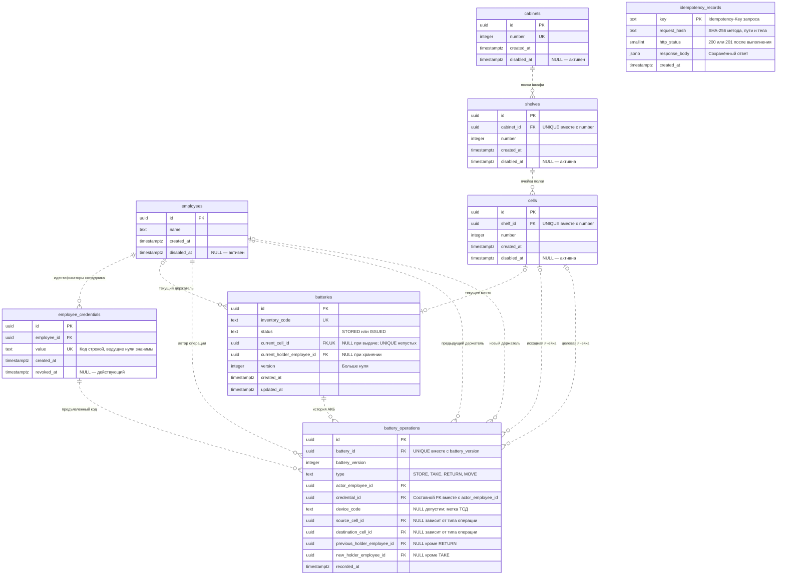

# ER-модель макета

Исполняемый перечень полей и ограничений — [schema.sql](schema.sql). Здесь их смысл и ответственность. `?` означает nullable; остальные поля обязательны. Все ID/FK — uuid; время — timestamptz; удаление исторических ссылок — RESTRICT.

## Таблицы

| Таблица | Поля и типы | PK/FK, UNIQUE, CHECK и индексы | Почему существует |
|---|---|---|---|
| employees | id uuid; name text; created_at timestamptz; disabled_at timestamptz? | PK id; непустое имя 1–200; индекс PK | Человек независимо от карты. Табельный номер в макете не требуется |
| employee_credentials | id uuid; employee_id uuid; value text; created_at timestamptz; revoked_at timestamptz? | PK id; FK employee; UNIQUE value и (id,employee_id); длина 1–128, без пробельных/управляющих; revoked_at ≥ created_at; индекс employee_id | Смена/отзыв карты без изменения сотрудника. Несколько активных допустимы; старые значения не переиспользуются |
| cabinets | id uuid; number integer; created_at timestamptz; disabled_at timestamptz? | PK id; UNIQUE number; number > 0 | Шкаф; номер уникален в макете |
| shelves | id uuid; cabinet_id uuid; number integer; created_at timestamptz; disabled_at timestamptz? | PK id; FK cabinet; UNIQUE(cabinet_id,number); number > 0 | Произвольное число полок шкафа; уникальный индекс покрывает поиск по cabinet_id |
| cells | id uuid; shelf_id uuid; number integer; created_at timestamptz; disabled_at timestamptz? | PK id; FK shelf; UNIQUE(shelf_id,number); number > 0 | Произвольное число ячеек полки; индекс пары покрывает shelf_id |
| batteries | id uuid; inventory_code text; status text; current_cell_id uuid?; current_holder_employee_id uuid?; version integer; created_at/updated_at timestamptz | PK id; UNIQUE inventory_code; FK cell/employee; status STORED/ISSUED; version>0; CHECK положения; частичный UNIQUE current_cell_id; индексы holder и (status,id) | Экземпляр АКБ плюс быстро читаемое текущее положение |
| battery_operations | id uuid; battery_id uuid; battery_version integer; type text; actor_employee_id uuid; credential_id uuid; device_code text?; source_cell_id uuid?; destination_cell_id uuid?; previous_holder_employee_id uuid?; new_holder_employee_id uuid?; recorded_at timestamptz | PK id; FK battery, actor, source/destination, holders; составной FK(credential_id,actor); UNIQUE(battery_id,battery_version); CHECK типа и формы перехода; индексы времени, автора, source/destination, credential | Неизменяемая история. Нет updated_at и произвольного JSON вместо предметных ссылок |
| idempotency_records | key text; request_hash text; http_status smallint?; response_body jsonb?; created_at timestamptz | PK key; формат ключа/хэша; согласованная nullable-пара ответа; статус 200/201 | Глобальные ключи и результаты всех изменяющих команд; нет FK к одной АКБ, поскольку создаются и справочники |

Операционные поля формы перехода:

| Тип | source | destination | previous_holder | new_holder |
|---|---|---|---|---|
| STORE | NULL | cell | NULL | NULL |
| TAKE | cell | NULL | NULL | actor |
| RETURN | NULL | cell | actor | NULL |
| MOVE | cell A | cell B, B≠A | NULL | NULL |

Эти nullable-поля выражают четыре конкретных перехода, контролируемых CHECK. Отдельная таблица на каждый тип усложнила бы историю без полезного эффекта. Правильность формы события не доказывает, что переход соответствует предыдущему состоянию: это обеспечивает сервис под блокировкой.

## Связи словами

- employees 1:N employee_credentials. Значение карты не PK сотрудника; отзыв сохраняет историческую запись.
- cabinets 1:N shelves; shelves 1:N cells. Родитель обязателен, номера уникальны только внутри него.
- cells 1:0..1 batteries для текущего места. Выданная АКБ не занимает ячейку.
- employees 1:N batteries для текущего держателя. Один сотрудник может держать несколько АКБ; каждая имеет максимум одного держателя.
- batteries 1:N battery_operations. Первая операция создаётся вместе с АКБ; FK сам по себе не гарантирует наличие этой первой строки.
- employees 1:N battery_operations как автор; отдельно как предыдущий и новый держатель.
- employee_credentials 1:N battery_operations. Составной FK доказывает, что сохранённый credential принадлежит автору.
- cells 1:N battery_operations отдельно как источник и назначение. Освобождение места не удаляет прежние операции.
- idempotency_records самостоятельна: сохраняет исходный ответ, не вычисляет его из текущей АКБ.

Исходник диаграммы: [schema.mmd](schema.mmd). Контрастная версия на белом фоне: [SVG](schema-light.svg) · [PNG](schema-light.png). PK — первичный ключ, FK — внешний ключ, UK — уникальность. Составные ограничения подписаны в полях; они не означают уникальность каждого поля отдельно. `idempotency_records` намеренно не имеет FK: хранит результаты команд как для АКБ, так и для справочников. Составной FK `(credential_id, actor_employee_id)` ссылается на `(id, employee_id)` карточки. NULL у `http_status` и `response_body` допустим только для резервирования внутри незавершённой транзакции.

## Значимые альтернативы

**UUID или BIGINT identity.** Оба корректны. UUID сохранён как в прототипе, не связан с условными кодами и не требует дополнительного преобразования контрактов. BIGINT занимает меньше места, но для небольшого макета это не причина менять подход. UUID не заменяет контроль доступа.

**Текущее состояние.** Выбраны поля batteries: одна блокируемая строка и простой GET. Отдельная battery_state добавит JOIN и создание второй строки без самостоятельного жизненного цикла. Последнее событие как единственный источник потребует сложнее получать содержимое ячеек/выданные АКБ. Журнал и состояние в одной транзакции дают нужную прослеживаемость без Event Sourcing.

**Тип операции.** Выбран text + CHECK: наглядный SQL и обычные миграции. PostgreSQL enum тоже подходит устойчивым спискам, но изменения типа связывают DDL с выпуском кода. operation_types полезна для редактируемых описаний, однако новая строка в справочнике не добавит обработчик и правила перехода. Для четырёх операций отдельный справочник не нужен.

**Credential.** Полный UNIQUE(value) намеренно строже уникальности активных: для макета старый код не переиспользуется. Если позже понадобится повторное назначение, заменить на частичный UNIQUE WHERE revoked_at IS NULL; история продолжит ссылаться на ID старой карточки. Индекса «одна активная карта на сотрудника» нет.

**Одна или несколько АКБ в ячейке.** Выбран подтверждённый вариант 1, обеспеченный UNIQUE. В альтернативе N этот индекс становится обычным, а при лимите появляется cells.capacity > 0. Все изменения занятости сериализуются блокировкой ячейки и проверкой COUNT под этой блокировкой; уменьшение capacity использует тот же протокол. Обычный CHECK не может надёжно контролировать число других строк. Вариант N не входит в текущий DDL.

**Устройства и аудит.** Для метки терминала достаточно device_code в событии; это неподтверждённое заявление клиента. Реестр devices нужен при управлении устройствами. Отдельный audit_log полезен при появлении входа и административных прав; сейчас истории credential и отключения ячейки достаточно для демонстрации, но это не полноценный аудит всех изменений.

**Измерения.** В будущем storage_condition_readings хранит датчик/место, параметры среды и measured_at; battery_measurements — battery_id, параметры АКБ и measured_at. Ни нормативы, ни поля temperature/voltage в batteries не добавляются.

## Граница ответственности

PostgreSQL гарантирует PK/FK, уникальность кодов и номеров, единственную АКБ в ячейке, форму состояния и события. Go в общей транзакции проверяет активность, предыдущий статус/держателя/источник, согласованность version и события, завершение ключа и ограничения отключения. CHECK не проверяет другие строки. DDL также содержит триггеры, запрещающие UPDATE/DELETE/TRUNCATE истории. При реализации прикладной роли выдаются только SELECT/INSERT на историю; владелец БД способен отключить триггеры, поэтому это не защита от администратора БД.

Основание ограничений: [PostgreSQL 17 — Constraints](https://www.postgresql.org/docs/17/ddl-constraints.html). Проектные решения о макете — наши решения, а не требования из документации PostgreSQL.
