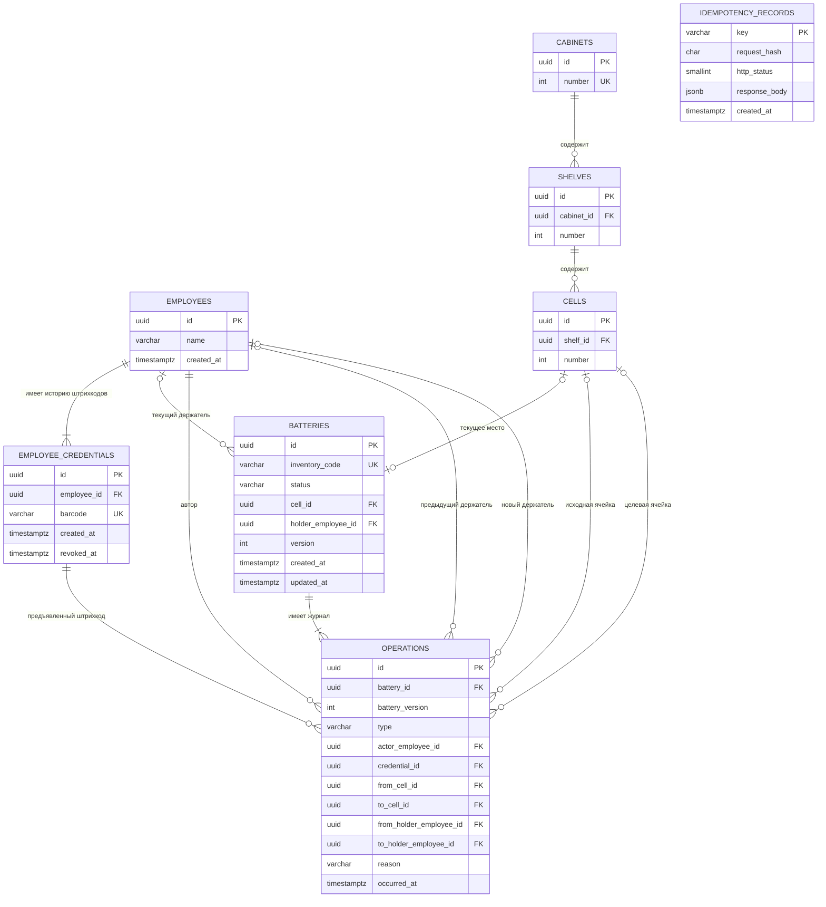

# Модель данных и API учёта АКБ

Статус: реализация v1, 29.09.2026. Основание: [spec.md](spec.md). Машиночитаемые контракты: [schema.sql](schema.sql), [openapi.yaml](openapi.yaml). Запуск: [README](../../../README.md).

## 1. Устройство приложения

Одно Go-приложение принимает REST/JSON и выполняет SQL-транзакции в PostgreSQL. Три области кода: справочники, команды учёта, чтение состояния/истории. Текущие данные и журнал принадлежат одному приложению и одной БД. Отдельные сервисы, очередь и event sourcing не нужны для описанных сценариев.

Карточка/штрихкод определяет участника команды. По последнему уточнению пользователя авторизации, ролей и API-ключей нет; API демонстрируется локально. `employee_barcode` — вход бизнес-сценария, не доказательство личности. Имена и штрихкоды в демонстрации вымышленные. API не обещает ограничивать пользователя только его данными.

## 2. ER-диаграмма

`idempotency_records` — техническая таблица результатов команд, без внешнего ключа к предметной сущности: она обслуживает и создание сотрудника, и движение АКБ. Нижняя граница «хотя бы одна запись» у сотрудника и АКБ обеспечивается транзакцией создания, не одним FK. Необязательные связи в операциях зависят от её типа.

## 3. Таблицы, ключи и ограничения

Все UUID v4 генерирует Go. Все даты — `timestamptz`, API выдаёт RFC3339 в UTC. Номера шкафов, полок и ячеек — положительные int32. Адрес вычисляется соединением их номеров через точку и не является ключом. В v1 структура не переименовывается и не удаляется.

| Таблица | Назначение и ограничения |
|---|---|
| employees | Имя обязательно, 1–200 символов после trim. Сотрудник не удаляется через API |
| employee_credentials | Строковый штрихкод 1–128 ASCII-символов `[A-Za-z0-9._:-]`, точное сравнение с учётом регистра, без trim и числового преобразования; уникален за всю историю. Один действующий штрихкод на сотрудника; старые записи с revoked_at сохраняются |
| cabinets | Уникальный номер шкафа |
| shelves | Уникальная пара (cabinet_id, number) |
| cells | Уникальная пара (shelf_id, number); занятость не дублируется отдельным полем |
| batteries | Уникальный inventory_code с тем же форматом, что у штрихкода, но в отдельном пространстве значений. CHECK связывает status с nullable cell_id/holder_employee_id. Частичный UNIQUE(cell_id) исключает две АКБ в одном месте |
| operations | Записи только добавляются. Содержат автора, предъявленную карточку, переход положения, причину потери и серверное время. UNIQUE(battery_id, battery_version) упорядочивает историю одной АКБ. Составной FK подтверждает принадлежность карточки автору |
| idempotency_records | Глобальный ключ команды, SHA-256 запроса, статус и JSON успешного ответа. Результат сохраняется вместе с изменениями; срок хранения в демонстрации не ограничен |

Индексы PK/UNIQUE покрывают поиск сущностей, штрихкодов и структуры. Для АКБ добавлены индексы по держателю и (status, id). Для журнала — (occurred_at DESC, id DESC) и составные индексы с battery_id, автором, исходным/новым держателем, исходной/целевой ячейкой. Они поддерживают фильтры API; OR по участникам и местам объединяет условия, а не создаёт дубликаты строк. Это отправная точка, не утверждение о проверенном плане запросов.

DDL гарантирует ссылки, уникальность, форму состояния и форму каждой операции. Проверка допустимого перехода, соответствие записи журнала новому состоянию, увеличение версии и заполнение идемпотентного ответа — обязанности одной сервисной транзакции. CHECK не используется для проверки других строк. При реализации учётной DB-роли дать `SELECT, INSERT` на operations, без `UPDATE, DELETE`; миграции выполняются отдельным владельцем. Это технические права PostgreSQL, не роли пользователей приложения.

## 4. Состояния и операции

| Команда | До | После | Переход в журнале |
|---|---|---|---|
| register | АКБ отсутствует | stored | нет → целевая ячейка; версия 1 |
| checkout | stored | issued | исходная ячейка → сотрудник, предъявивший штрихкод |
| return | issued | stored | предыдущий держатель → выбранная свободная ячейка |
| move | stored | stored | исходная ячейка → другая свободная ячейка |
| loss | stored или issued | lost | последнее известное место/держатель → неизвестное положение |

Каждая следующая операция увеличивает `version` на 1. Для stored обязательна только cell_id; для issued — только holder_employee_id; для lost оба значения null. При loss прошлое положение остаётся в `operations.from_*`, а не в полях текущего местонахождения. API Battery возвращает `last_operation_id`, вычисленный через текущую версию, чтобы получить последний след через `/operations/{id}`.

Автор возврата может отличаться от предыдущего держателя. Любой сотрудник с действующим штрихкодом может отметить потерю или выполнить перемещение. Причина потери обязательна (1–500 символов после trim). Перемещение в ту же ячейку — 409 INVALID_TRANSITION. Повторная потеря и любая новая операция над lost — 409 INVALID_TRANSITION. Обнаружение, исправление и удаление не представлены маршрутами.

## 5. Транзакции и конкурентность

Уровень изоляции — READ COMMITTED. Команда выполняется последовательно:

1. Проверить синтаксис тела, UUID и Idempotency-Key. Начать транзакцию; зарезервировать ключ команды.
2. Если ключ уже выполнен, сравнить хэш и вернуть сохранённый ответ либо конфликт. Повтор проверяется до проверки текущей активности карточки и состояния АКБ.
3. Для учётных команд найти действующий штрихкод и взять `FOR SHARE` на credential: замена не может отозвать его посередине операции. Неизвестный или отозванный штрихкод — 404 EMPLOYEE_NOT_FOUND.
4. Для существующей АКБ взять `SELECT ... FOR UPDATE` на её строку, затем проверять актуальное состояние. Блокировки ячеек не нужны: занятость арбитрируется уникальным индексом batteries.cell_id.
5. Проверить целевую ячейку, выполнить изменение АКБ, вставить ровно одну операцию с той же новой версией и сформировать ответ.
6. Сохранить HTTP-статус и тело ответа в записи ключа, затем COMMIT. Только после успешного COMMIT отдать успех.

Конкурентные выдачи одной АКБ сериализуются её блокировкой; проигравшая видит issued и получает 409. При двух разных АКБ на одну ячейку UNIQUE пропускает только одну транзакцию; ошибку именованного индекса one_battery_per_cell преобразовать в 409 CELL_OCCUPIED после ROLLBACK. Не превращать все нарушения UNIQUE в одну ошибку: инвентарный код, штрихкод и номер структуры имеют свои коды конфликтов.

При deadlock/lock timeout транзакция откатывается и возвращается 503 TEMPORARILY_UNAVAILABLE; клиент повторяет с тем же ключом. Если результат COMMIT неизвестен из-за обрыва соединения, повтор с тем же ключом позволяет выяснить исход. Время команды берётся сервером БД при записи операции после получения блокировок; это время регистрации действия в системе, не показание настоящего шкафа. updated_at АКБ равно occurred_at операции.

Создание сотрудника и первого credential атомарно. Замена штрихкода блокирует строку сотрудника FOR NO KEY UPDATE, затем старую credential FOR UPDATE, помечает её отозванной и вставляет новую. FOR NO KEY UPDATE сериализует замены, но совместим с FK KEY SHARE от операций АКБ, устраняя лишний цикл блокировок. Новая карточка не может принадлежать другому сотруднику или совпадать с ранее использованным кодом; 409 BARCODE_EXISTS. Если новое значение равно текущему действующему, вернуть его без изменения, 200. Конкурентные замены выполняются последовательно; при успешных разных командах действующей будет последняя. Имя/UUID сотрудника и старые операции не меняются.

## 6. Повторы запросов

`Idempotency-Key` обязателен на всех POST и PUT: строка 1–128 символов того же ASCII-алфавита. Область уникальности — вся демонстрационная БД, поэтому рекомендуется случайный UUID. Хэш: SHA-256 от UTF-8 строки `METHOD + "\n" + canonical_path + "\n" + canonical_body`. Path использует lowercase UUID; canonical_body — JSON валидированной структуры с полями в лексикографическом порядке, уже нормализованными UUID и trim имени/причины. Query у изменяющих маршрутов запрещён. Неизвестные/повторяющиеся JSON-поля и null во входе отклоняются.

Резервирование: `INSERT ... ON CONFLICT DO NOTHING`, затем чтение существующей записи. При конкурентном повторе INSERT ждёт исхода первой транзакции. Одинаковый ключ и запрос возвращают исходный HTTP-статус и JSON (сравнение тела по JSON-значениям), включая старое состояние на момент команды; актуальное состояние читают отдельным GET. Другой запрос с этим ключом — 409 IDEMPOTENCY_CONFLICT.

Ключ, изменения и ответ фиксируются в одной транзакции. Резервирование с пустым ответом нельзя коммитить: это прикладной инвариант. Ответы 4xx/5xx не сохраняются, транзакция с ключом откатывается. Поэтому исправленную неуспешную команду можно повторить с тем же ключом. Запись сохраняет response_body JSONB; сырой штрихкод запроса в ней не хранится, но ответ создания/замены credential содержит его согласно контракту.

## 7. Правила API

Базовый URL приложения: `http://127.0.0.1:8080/api/v1`. Нет login, токенов, ролей и `securitySchemes`. Все записи выполняются командами; произвольное редактирование статуса запрещено отсутствием такого маршрута. Размер запроса ограничен 64 KiB, иначе 413 REQUEST_TOO_LARGE. При неправильном Content-Type — 415 UNSUPPORTED_MEDIA_TYPE.

Списки возвращают `{items, limit, offset}`, limit 1–100 (по умолчанию 50), offset ≥ 0. Справочники и АКБ сортируются по UUID ASC; журнал по occurred_at DESC, id DESC. Offset-пагинация не гарантирует снимок между запросами при новых записях; для демонстрации это принятое упрощение. GET не меняет состояние.

Фильтры списка АКБ: status, holder_employee_id, cell_id, inventory_code. Фильтры истории: battery_id, employee_id (автор ИЛИ прежний ИЛИ новый держатель), cell_id (откуда ИЛИ куда), from (включительно), to (исключительно). Разные фильтры соединяются AND; from ≥ to — 400. Корректный UUID без совпадений в фильтре даёт пустой список; отсутствующий ресурс в маршруте/команде — 404. Потеря не удаляет историю связи с сотрудником/местом, но батарея lost больше не попадает в фильтр текущего держателя/ячейки.

UUID в JSON — строки. Номера и версии — int32. Текстовые коды не преобразуются в числа, не обрезаются и не меняют регистр. Дополнительные поля запрещены в запросах. Nullable поля ответов возвращаются явно как null. Вход не задаёт время операции, состояние, автора по UUID или версию журнала — их определяет сервер.

Ошибки имеют вид `{ "code": "CELL_OCCUPIED", "message": "Ячейка уже занята" }`. Клиент зависит от code, не от текста. Набор: 400 VALIDATION_ERROR; 404 EMPLOYEE_NOT_FOUND/RESOURCE_NOT_FOUND; 409 CELL_OCCUPIED/INVALID_TRANSITION/INVENTORY_CODE_EXISTS/BARCODE_EXISTS/NUMBER_EXISTS/IDEMPOTENCY_CONFLICT; 413 REQUEST_TOO_LARGE; 415 UNSUPPORTED_MEDIA_TYPE; 503 TEMPORARILY_UNAVAILABLE; 500 INTERNAL_ERROR. Детали SQL наружу не возвращаются.

## 8. Swagger UI

Обязательные служебные маршруты Go-сервера: `GET /swagger/` (HTML), статические ресурсы под `/swagger/`, `GET /swagger` (редирект на `/swagger/`) и `GET /openapi.yaml` (контракт, `Content-Type: application/yaml`). Они находятся вне префикса бизнес-API `/api/v1` и не требуют Idempotency-Key.

Swagger UI загружает контракт через `url: "/openapi.yaml"`. В OpenAPI `servers[0].url` равен `/api/v1`, чтобы Try it out работал на том же origin и порту, где открыта документация. В настройках UI отключить внешний валидатор (`validatorUrl: null`); валидация контракта выполняется локально при проверках проекта.

Использовать статический дистрибутив Swagger UI с зафиксированной версией, отдаваемый тем же Go-сервером. Сохранить сведения о версии и лицензию дистрибутива. Не требуется отдельное frontend-приложение или сервер документации. Ресурсы UI и контракт включить в поставку сервиса; допустима автоматическая копия для встраивания при сборке, но редактируется только исходный openapi.yaml. Проверка сборки должна обнаруживать расхождение копии с источником.

В UI видны все 19 бизнес-операций, схемы, примеры и ошибки. Пользователь может задать Idempotency-Key для каждой изменяющей команды. Не генерировать ключ заново незаметно при повторе: UI должен позволять вручную проверить повтор одной команды. README описывает запуск, оба URL и пример создания сотрудника через Try it out.

Основание способа поставки: [официальная установка Swagger UI](https://swagger.io/docs/open-source-tools/swagger-ui/usage/installation/). Реализация в `swagger/` встраивает локальные ресурсы; `assets.go` напрямую встраивает единственный исходный OpenAPI. Браузерный сценарий `scripts/browser-smoke.cjs` блокирует внешние подключения, проверяет все операции и выполняет Try it out.

## 9. Основания технических решений

Уникальные ограничения, внешние ключи и CHECK выбраны по [документации PostgreSQL](https://www.postgresql.org/docs/current/ddl-constraints.html). Блокировки строк описаны в [Explicit Locking](https://www.postgresql.org/docs/current/explicit-locking.html). Синтаксис контракта следует [OpenAPI 3.0.3](https://spec.openapis.org/oas/v3.0.3.html). Источники проверены 28.09.2026. Это обоснование механики, не доказательство тестирования будущего приложения.
